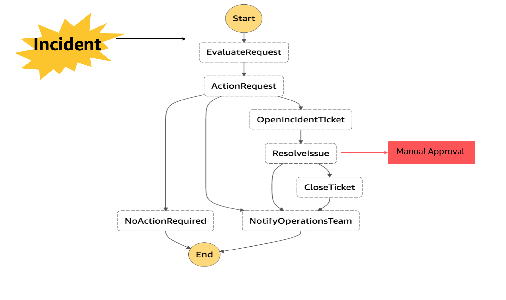
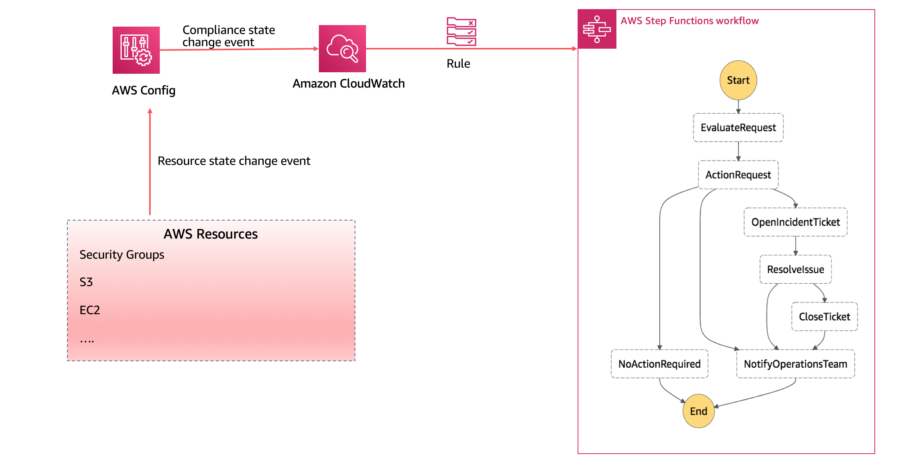

# IT Operations Automation using AWS Step functions

## Overview

"Everything fails all the time" - Werner Wogels

Everything fails all the time and our systems should be ready to respond to such kind of events automatically. To automate the entire incident management you need a workflow that gets triggered when an incident happens. Let's take a simple usecase.

## A simple automation usecase

I want an auto-remediation (self-healing) solution for incidents like opening of SSH port, low disk space, or when a public access is given to a S3 bucket

The workflow will look like this.

Note: Manual approval is a optinal step.

We need some kind of work flow engine that can keep track of various states, re-try things and also have a capability of manual intevention when required. AWS Step function is a service that perfectly fits this usecase.

AWS Step Functions provides auditable automation of routine deployments, upgrades, installations, and migrations. You can use Step Functions to easily automate recurring tasks such as patch management, infrastructure selection, and data synchronization, and Step Functions will automatically scale, respond to timeouts, and retry failed tasks.

We can change the above workflow to below architecture using AWS Step functions.

## About the repo
This code repsoitory will help you to create a workflow engine template that you can re-use for your automation requirements.

ITAutomationWorkFlow.yaml will create following object in your environment

1. State Machine: It will create a state machine depcting above flow. 

State machine details are there in stepfunction.json

2. EvaluateRequest lambda function: A Lambda function to evaluate the incident and take a decision on the next steps. It will decide whether an automation process is required or a manual approval is required or nothing has to be done.

3. OpenIncident lambda function: A Lambda function to open the incident ticket.

4. ResolveIncident lambda function:
A Lambda to resolve the incident. For example, closign the SSH port or removing the public access for S3 bucket.

5. PrepareMessage lambda function: A Lambda function to close ticket and prepare the message/email for Operations manager. 

## How to Use?

Open ITAutomationWorkFlow.yaml in the root directory

1. Update the notificaiton email id: This will be the id where the notificaiton email will be sent when an incident occurs in your enviroment. You can also change it as part of running the Cloud Formation template on AWS Console.

2. Update the CodeUri path of all Lambda functions: Right now it is pointing to my S3 bucket. You can go to Artifacts folder and upload all the source code of Lambda and Sate machine in your account and then replace my S3 bucket path with yours.

You can now go to AWS CloudFormation console and run the ITAutomationWorkFlow.yaml template. It will create 5 lambda functions and a state machine. You can see it in the output section of CloudFormation execution.

## Configuring Event to target Step function
Once the workflow engine is ready. You can configure events in CloudWatch and select State machine (AWS Step Functions) as the target.

This will trigger the State Machine when you an event occurs and you can track the workflow in Step Functions.

## License

This library is licensed under the MIT-0 License. See the LICENSE file.
